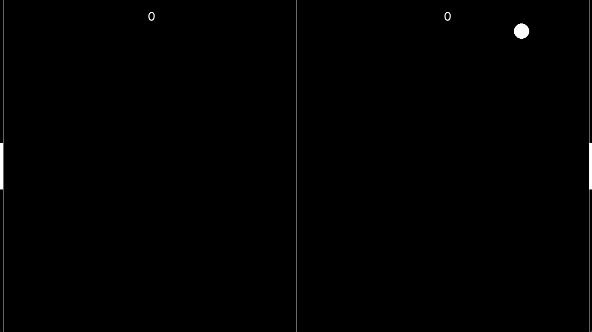

# Pong Game 🎮

A classic Pong game implemented in Python using **Pygame**.  
This version is object-oriented and features:

- Ball and paddle movement
- Collision detection
- Score tracking
- Fullscreen support
- Adjustable game speed

---

## Screenshots




---

## Installation

1. Clone the repository:

```bash
git clone https://github.com/yourusername/pong-game.git
cd pong-game
````

2. Install dependencies:

pip install -r requirements.txt

Run the game with:

python game.py


### Controls:

* **Player 1 (Left paddle):** `W` (up), `S` (down)
* **Player 2 (Right paddle):** `Up Arrow` (up), `Down Arrow` (down)
* **Exit game:** Close window or press `ESC`

---

## Fullscreen Mode

The game automatically supports fullscreen. You can scale elements by changing the `WIDTH` and `HEIGHT` variables or using `pygame.FULLSCREEN`.

---

## Requirements

* Python 3.9+
* [Pygame 2.6.1](https://www.pygame.org/news)

Install all dependencies via:

```bash
pip install -r requirements.txt
```

---

## License

This project is licensed under the MIT License.

---

## Contributing

Feel free to fork the repo, improve the game, and submit a pull request.

---

## Author

* Your Name
* GitHub: [DTR]((https://github.com/thirupathi-rao))

```

---

I can also **enhance it with a GIF of gameplay, badges, and instructions for deploying on GitHub Pages/Streamlit** if you want it to look more interactive for your repo.  

Do you want me to do that?
```
